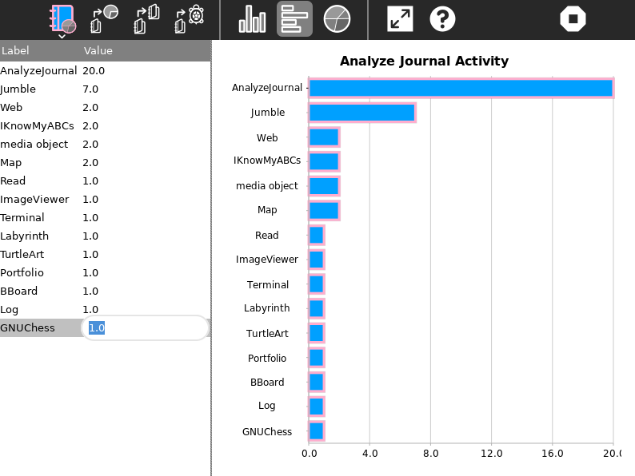

AnalyzeJournal Activity
===============
This Activity charts data from the Sugar Journal and gives you a visual representation of Disk usage, Activity usage and Turtle data usage using a vertical bar chart, a horizontal bar chart or a pie chart.

How to use?
===============
AnalyzeJournal Activity is not a part of Sugar Desktop but can be added. Refer to the following links-

* [How to Get Sugar on sugarlabs.org](https://sugarlabs.org/)
* [How to use Sugar](https://help.sugarlabs.org/)
* [Download AnalyzeJournal](https://activities.sugarlabs.org/en-US/sugar/addon/4545)

First select Disk usage, Activity usage or Turtle data (the one you wish to see the graphical represenation of) and then click on the type of chart you wish to see. You can also save the chart dispayed as an image by clicking on 'save as image'.

How to upgrade?
===============
On Sugar Desktop systems;

* [Use My Settings,](https://help.sugarlabs.org/my_settings.html) [Software Update](https://help.sugarlabs.org/my_settings.html#software-update) 
* Use Browse to open [activities.sugarlabs.org](https://activities.sugarlabs.org/) Search for Paths, then download

